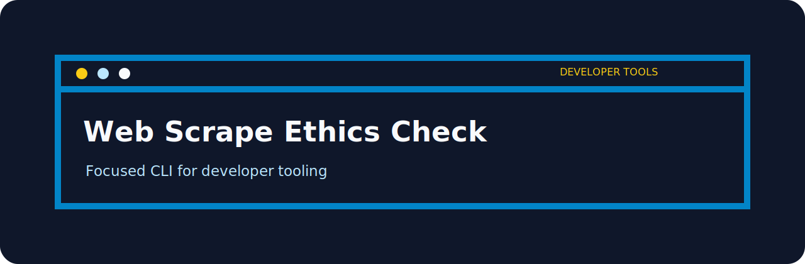
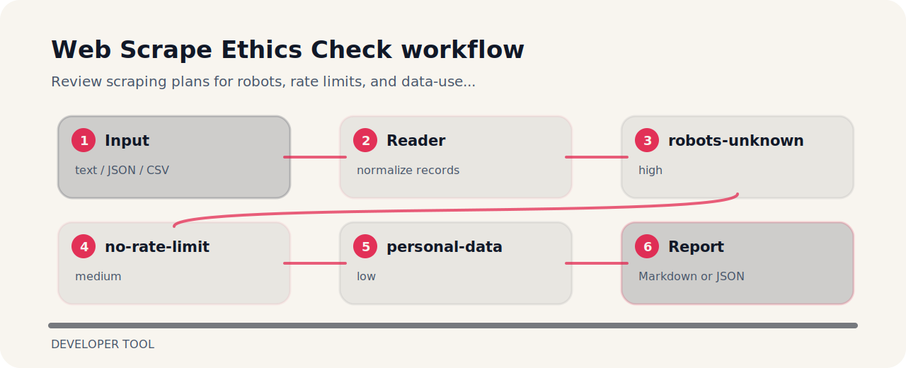

# Web Scrape Ethics Check

| Detail | Value |
| --- | --- |
| Area | developer tool |
| Entry | `web-scrape-ethics-check` |
| Input | plain text |
| Output | terminal findings, optional JSON |



## What it protects

Web Scrape Ethics Check is meant for quick pull-request checks around developer tooling. It favors explicit rules over a bulky dashboard.

## Policy flow



## What gets flagged

- `robots-unknown` - robots policy unknown (high); check robots and terms.
- `no-rate-limit` - rate limit missing (medium); set polite crawl rate.
- `personal-data` - personal data may be scraped (low); review privacy basis.

## Run the sample

```bash
git clone https://github.com/mertefekurt/web-scrape-ethics-check.git
cd web-scrape-ethics-check
python -m pip install -e ".[dev]"
web-scrape-ethics-check examples/sample.txt
```
